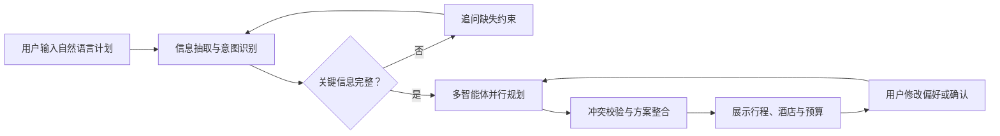
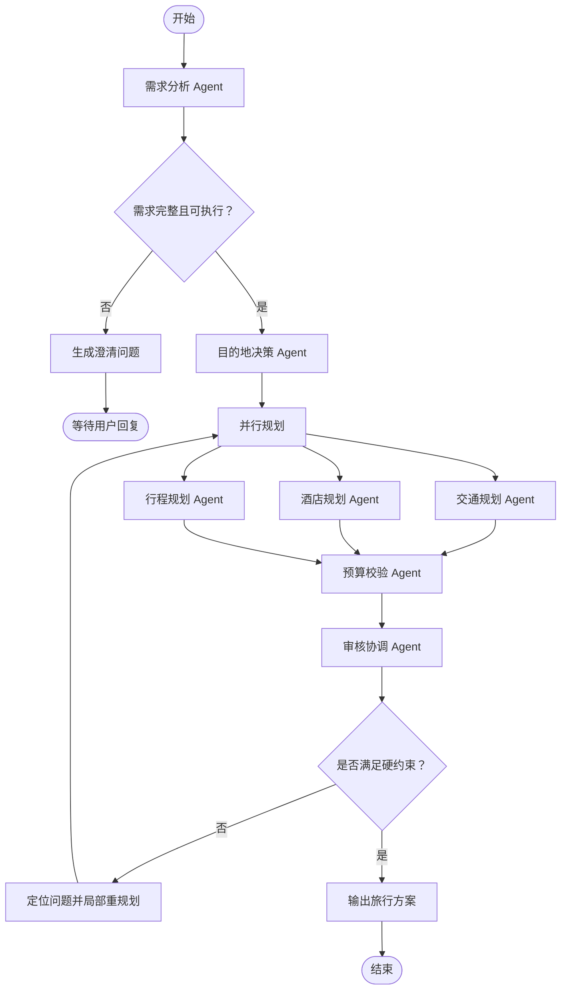

# TripWeave - 旅差智能助手

## 当前 Demo

第一版已提供一个最小可用的 Agent 对话 Demo：

- 前端：React + Vite 中文聊天界面
- 后端：FastAPI 的 `POST /api/v1/chat/messages`
- 模型：DeepSeek `deepseek-v4-flash`
- 会话：仅保存在浏览器当前页面，不写入数据库

### 启动

1. 在 `backend` 目录创建 `.env`，填写 DeepSeek API 密钥：

   ```powershell
   Copy-Item .env.example .env
   ```

   编辑 `backend/.env`，设置：

   ```dotenv
   DEEPSEEK_API_KEY=你的密钥
   ```

2. 启动后端：

   ```powershell
   cd backend
   python -m venv .venv
   .\.venv\Scripts\Activate.ps1
   pip install -r requirements.txt
   uvicorn app.main:app --reload --port 8000
   ```

3. 新开一个终端，启动前端：

   ```powershell
   cd frontend
   npm install
   npm run dev
   ```

浏览器打开 Vite 显示的地址，默认通常为 `http://localhost:5173`。后端健康检查为 `http://127.0.0.1:8000/api/v1/health`，也可访问 `http://127.0.0.1:8000/health`。

### 配置

后端从 `backend/.env` 读取以下变量：

| 变量 | 默认值 | 用途 |
| --- | --- | --- |
| `DEEPSEEK_API_KEY` | 空 | DeepSeek API 密钥，必填 |
| `DEEPSEEK_BASE_URL` | `https://api.deepseek.com` | OpenAI 兼容 API 地址 |
| `DEEPSEEK_MODEL` | `deepseek-v4-flash` | 对话模型 |

前端可选通过 `VITE_API_BASE_URL` 指向不同的后端地址；默认使用 `http://127.0.0.1:8000`。

---

## 1. 项目概述

TripWeave 是一个基于 LangGraph 的多智能体协作旅差智能助手。用户以自然语言描述出行计划，系统将提取关键出行信息，主动补齐缺失条件，并由多个专业智能体协作完成目的地、交通、行程与酒店方案规划。

项目第一阶段聚焦“方案规划与推荐”，不直接完成机票、火车票或酒店的真实下单；后续可接入供应商 API 扩展预订能力。

## 2. 用户需求

### 2.1 目标用户

- 有出差安排的职场用户
- 需要组合规划交通、酒店和游玩活动的个人旅行用户
- 需要快速生成可执行行程的行政或助理角色

### 2.2 核心用户流程



### 2.3 用户输入信息

| 类型 | 信息 |
| --- | --- |
| 核心信息 | 出发地、目的地或候选城市、出行日期、返程日期、出行人数 |
| 出差约束 | 会议/客户地点、固定日程、公司差旅标准、报销规则 |
| 偏好信息 | 交通偏好、酒店星级、预算、饮食、景点类型、行程节奏 |
| 可选信息 | 航班/车次偏好、会员权益、无障碍需求、同行人偏好 |

### 2.4 MVP 功能

- 用自然语言解析出行计划并结构化保存
- 自动追问缺失的关键条件
- 根据地点、日期和预算生成交通建议
- 编排按天、按时间段的行程
- 按位置、预算、评分和设施筛选酒店
- 输出预算估算、时间冲突和风险提示
- 支持对日期、预算、酒店或日程进行局部重规划

### 2.5 后续功能

- 接入高德地图、航旅/铁路、酒店与天气等实时数据
- 多方案对比与一键替换
- 企业差旅政策、审批流和费用归集
- 真实预订、订单管理和行程提醒
- 用户画像、历史偏好与长期记忆

## 3. 技术栈

| 分层 | 技术选择 | 用途 |
| --- | --- | --- |
| 后端语言 | Python 3.12+ | AI 编排、服务接口与数据处理 |
| 多智能体编排 | LangGraph | 管理共享状态、节点路由、并行协作与重规划循环 |
| LLM 应用层 | LangChain | 模型调用、提示词、结构化输出和工具封装 |
| 大模型 | 可配置的 OpenAI 兼容模型 | 意图理解、约束提取、推理与方案生成 |
| API 服务 | FastAPI + Uvicorn | 提供聊天、计划、确认与重规划接口 |
| 数据校验 | Pydantic v2 | 定义请求、领域模型和 Agent 输出契约 |
| 数据库 | PostgreSQL | 保存用户、旅行计划、候选方案与确认记录 |
| 缓存/任务 | Redis | 缓存热点数据、会话状态与异步任务队列 |
| ORM/迁移 | SQLAlchemy + Alembic | 数据访问与数据库版本迁移 |
| 外部工具 | 地图、天气、交通、酒店 API | 地理检索、路线、价格、库存与天气数据 |
| 前端 | React + TypeScript + Vite | 旅行对话、方案编辑与时间轴展示 |
| UI | Tailwind CSS + shadcn/ui | 构建清晰、可维护的业务界面 |
| 测试 | Pytest、httpx、Playwright | 单元、接口和端到端测试 |
| 工程化 | Docker Compose、Ruff、Pyright、pre-commit | 本地一致性、代码质量与部署基础 |

## 4. 多智能体设计

### 4.1 Agent 职责

| Agent | 输入 | 输出 | 主要职责 |
| --- | --- | --- | --- |
| 需求分析 Agent | 用户原始表达、历史对话 | `TripRequirements` | 提取结构化需求，识别缺失与不确定信息 |
| 目的地决策 Agent | 需求、候选地点、约束 | `DestinationDecision` | 在目的地未确定时评估城市可行性 |
| 交通规划 Agent | 日期、地点、偏好、交通数据 | `TransportPlan` | 给出往返和市内通勤建议 |
| 行程规划 Agent | 固定日程、交通、偏好、地图/天气 | `ItineraryPlan` | 安排会议、通勤、餐饮、游玩与空闲时间 |
| 酒店规划 Agent | 会议地点、预算、入住时间、酒店数据 | `HotelPlan` | 推荐可解释、可替换的住宿选项 |
| 预算校验 Agent | 交通、酒店、行程费用 | `BudgetAssessment` | 汇总费用，识别超标项与替代方案 |
| 审核协调 Agent | 所有子方案、原始约束 | `TripProposal` | 检测时间/地理/预算冲突，输出最终方案 |

### 4.2 LangGraph 工作流



### 4.3 共享状态原则

- 使用 Pydantic 模型定义 LangGraph State，禁止依赖自由文本作为跨 Agent 的唯一数据格式。
- 区分硬约束与软偏好：日期、固定会议和预算上限优先级最高。
- 每个 Agent 只写入自己负责的状态字段，并保留来源、置信度和生成时间。
- 审核协调 Agent 不重新猜测用户意图，只负责整合与识别冲突。
- 对外部 API 返回的时效数据记录查询时间与失效时间，避免使用过期价格做确认结论。

## 5. 核心领域模型

```text
TripRequirements
  - traveler_profile
  - origin
  - destination_candidates
  - departure_date / return_date
  - travelers_count
  - fixed_events
  - transport_preferences
  - hotel_preferences
  - budget
  - leisure_preferences
  - missing_fields

TripState
  - requirements
  - destination_decision
  - transport_plan
  - hotel_plan
  - itinerary_plan
  - budget_assessment
  - validation_issues
  - clarification_questions
  - final_proposal
```

## 6. 项目文件结构

```text
TripWeave/
├── README.md
├── .env.example
├── pyproject.toml
├── docker-compose.yml
├── Makefile
├── backend/
│   ├── app/
│   │   ├── main.py                     # FastAPI 应用入口
│   │   ├── config.py                   # 环境变量与应用配置
│   │   ├── api/
│   │   │   ├── exception/
│   │   │   │   ├── exceptions.py       # 自定义异常类与错误响应结构
│   │   │   │   └── exception_handlers.py # 统一异常处理函数
│   │   │   └── router/
│   │   │       ├── chat.py             # 对话接口与模型调用
│   │   │       ├── trips.py            # 行程 CRUD、确认、重规划
│   │   │       └── health.py            # 健康检查接口
│   │   ├── agents/
│   │   │   ├── graph.py                # LangGraph 图构建与路由
│   │   │   ├── state.py                # 共享状态和 reducer
│   │   │   ├── nodes/
│   │   │   │   ├── intake.py
│   │   │   │   ├── destination.py
│   │   │   │   ├── transport.py
│   │   │   │   ├── hotel.py
│   │   │   │   ├── itinerary.py
│   │   │   │   ├── budget.py
│   │   │   │   └── review.py
│   │   │   └── prompts/
│   │   │       ├── intake.md
│   │   │       ├── itinerary.md
│   │   │       └── review.md
│   │   ├── domain/
│   │   │   ├── schemas/                # Pydantic 输入输出模型
│   │   │   ├── services/               # 领域规则和方案组装
│   │   │   └── repositories/           # 数据访问接口
│   │   ├── integrations/
│   │   │   ├── llm/                    # 模型客户端与结构化输出
│   │   │   ├── maps/                   # 地图、地理编码与路线工具
│   │   │   ├── transport/              # 航班、铁路和本地交通工具
│   │   │   └── hotels/                 # 酒店搜索与详情工具
│   │   ├── db/
│   │   │   ├── models/
│   │   │   ├── session.py
│   │   │   └── migrations/
│   │   └── workers/                    # 异步刷新与长任务
│   └── tests/
│       ├── agents/
│       ├── api/
│       ├── domain/
│       └── integrations/
├── frontend/
│   ├── src/
│   │   ├── app/
│   │   ├── features/
│   │   │   ├── trip-chat/
│   │   │   ├── itinerary/
│   │   │   ├── hotel-selection/
│   │   │   └── budget/
│   │   ├── components/
│   │   ├── lib/
│   │   └── types/
│   ├── public/
│   └── package.json
├── docs/
│   ├── architecture.md
│   ├── api-contract.md
│   ├── prompt-guidelines.md
│   └── adr/
└── scripts/
    ├── dev.ps1
    ├── test.ps1
    └── seed_demo_data.py
```

## 7. API 初稿

| 方法 | 路径 | 说明 |
| --- | --- | --- |
| `POST` | `/api/v1/chat/messages` | 发送自然语言输入，返回流式 Agent 进度与回复 |
| `POST` | `/api/v1/trips` | 创建旅行规划会话 |
| `GET` | `/api/v1/trips/{trip_id}` | 获取当前旅行方案和规划状态 |
| `PATCH` | `/api/v1/trips/{trip_id}/requirements` | 更新日期、预算等局部约束 |
| `POST` | `/api/v1/trips/{trip_id}/replan` | 触发局部或完整重规划 |
| `POST` | `/api/v1/trips/{trip_id}/confirm` | 确认交通、酒店和日程方案 |
| `GET` | `/api/v1/health` | 服务健康检查 |

## 8. 数据与安全要求

- API Key、数据库连接和第三方密钥只能通过环境变量提供，不提交真实密钥。
- 用户行程、联系人、会议地点等数据按用户隔离，并提供删除机制。
- 对外部工具调用设置超时、重试与降级策略；失败时明确告知哪些信息未实时验证。
- 将模型输出解析为结构化数据后再写库或展示，不直接信任自由文本。
- 所有金额、时间和时区须记录来源；跨城市行程统一使用明确的本地时区。

## 9. MVP 里程碑

1. 搭建 FastAPI、LangGraph、Pydantic 后端骨架，并实现模拟数据工具。
2. 完成需求分析 Agent、澄清问答和共享状态持久化。
3. 完成交通、酒店、行程三个规划 Agent 与审核协调 Agent。
4. 建立 React 对话页面、行程时间轴、酒店候选列表和预算摘要。
5. 接入首批真实地图、天气和酒店数据，完善测试、可观测性与 Docker 部署。

## 10. 首个可演示场景

用户输入：

> 我 9 月 12 日从杭州去北京出差，15 日返回。13 日上午在国贸开会，预算 6000 元，酒店要干净安静，晚上想吃北京菜。

系统应完成：

1. 识别日期、出发地、目的地、固定会议、预算和住宿偏好。
2. 在缺少出发时间、人数等关键条件时进行追问或采用可解释默认值。
3. 生成杭州至北京的往返交通候选。
4. 推荐国贸周边符合预算的酒店并说明理由。
5. 在会议安排之外生成合理的餐饮和可选活动。
6. 给出交通、住宿与日常费用的预算汇总，并提示不确定价格需要实时确认。
