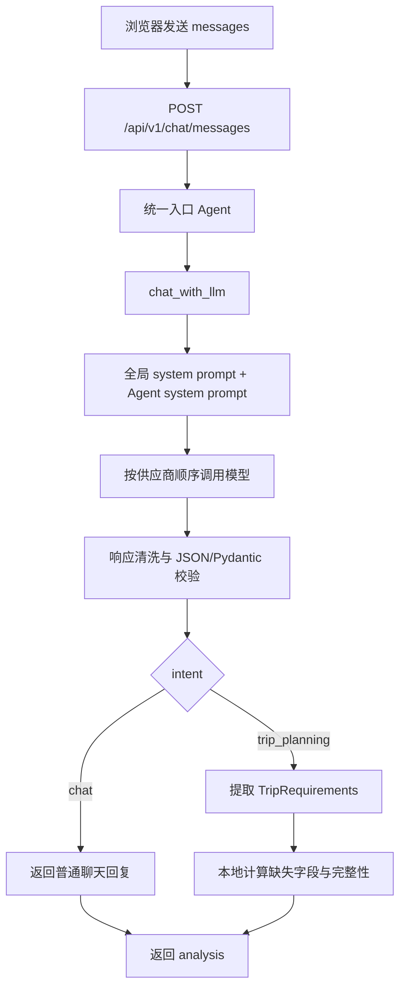
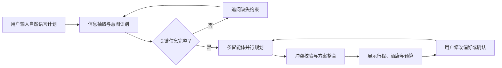
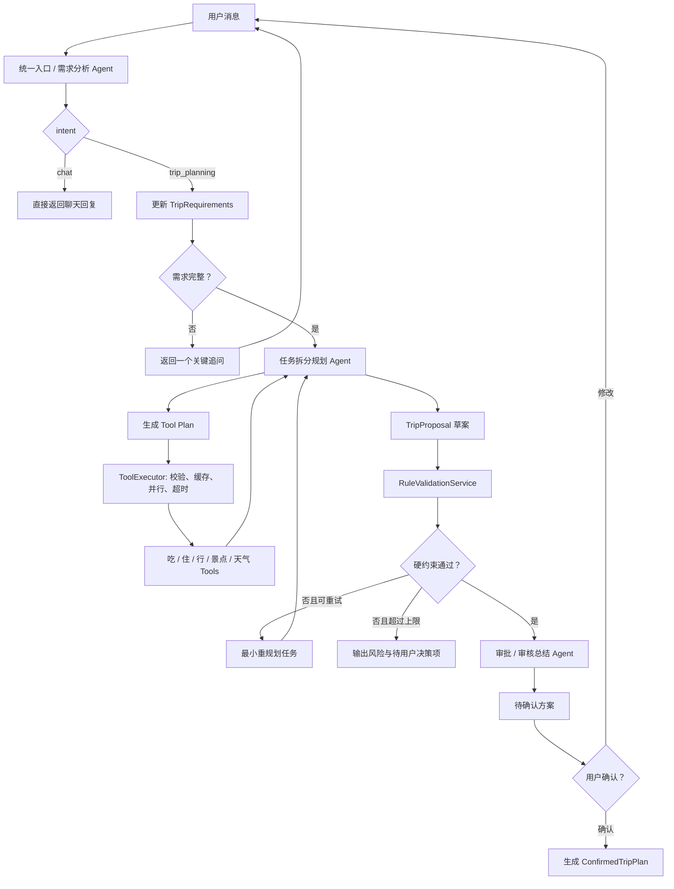
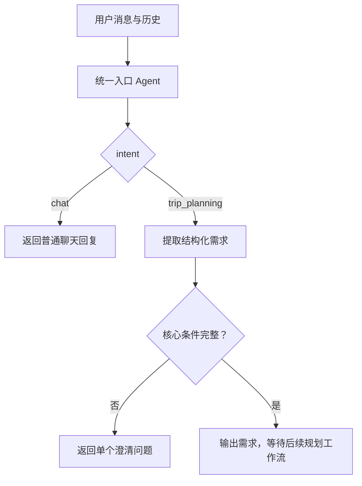

# TripWeave - 旅差智能助手

## 当前 Demo

第一版已提供一个最小可用的 Agent 对话 Demo：

- 前端：React + Vite 中文聊天界面
- 后端：FastAPI 的 `POST /api/v1/chat/messages`
- 模型：支持 DeepSeek、OpenAI 与 OpenAI 兼容第三方中转站
- 会话：仅保存在浏览器当前页面，不写入数据库
- 统一入口 Agent：一次调用判断普通聊天或旅差规划，并在旅差场景提取结构化需求
- 身份与行为约束：由后端全局系统提示词和 Agent 专用系统提示词共同注入

### 当前子智能体逻辑（截至 2026-08-14）

当前仅实现一个统一入口 Agent：`backend/app/agents/conversation_entry_agent.py`。它替代独立闲聊 Agent 与纯需求分析 Agent，避免为一次用户消息重复调用模型。



入口 Agent 的输出为 `ConversationAnalysis`：

| 字段 | 含义 |
| --- | --- |
| `intent` | `chat` 或 `trip_planning` |
| `reply` | 可直接展示给用户的中文回复 |
| `requirements` | 仅旅差规划场景返回的 `TripRequirements`；普通聊天为 `null` |
| `missing_fields` | 本地规则计算出的缺失核心字段 |
| `is_complete` | 旅差需求是否已达到进入后续规划的最低条件；普通聊天为 `null` |

当前最低完整条件为：目的地、出发时间、返程时间或旅行天数、出行人数。信息不足时，入口 Agent 只追问最关键的一项。

旅行时长使用 `TripDuration` 对象表达，而不是展示字符串：

```json
{
  "raw_text": "一个月",
  "amount": 1,
  "unit": "month",
  "is_approximate": false
}
```

`raw_text` 保留用户表达；`amount` 与 `unit` 供后续规划使用，单位只能是 `hour`、`day`、`week` 或 `month`。例如“半天”为 `0.5 + day`，“一周”为 `1 + week`，“一个月”为 `1 + month`。周和月不预先折算为固定天数，后续在已知出发日期时按日历规则计算。

### 已实现与未实现边界

| 状态 | 内容 |
| --- | --- |
| 已实现 | 统一入口 Agent、结构化需求提取、普通聊天分流、全局/Agent 系统提示词、文本清洗、Pydantic 校验、LLM 重试与供应商切换、前端失败回合重试、行程快速补充面板、核心结构化响应单元测试 |
| 未实现 | LangGraph 图、共享状态持久化、交通/酒店/行程/预算/审核 Agent、地图/天气/酒店实时工具、数据库、Redis、`/api/v1/trips` 接口、端到端测试与 Docker 部署 |

### 启动

1. 在 `backend` 目录创建 `.env`，选择模型供应商并填写对应配置：

   ```powershell
   Copy-Item .env.example .env
   ```

   编辑 `backend/.env`，设置：

   ```dotenv
   LLM_PROVIDER=deepseek
   DEEPSEEK_API_KEY=你的密钥
   ```

2. 启动后端：

   ```powershell
   cd backend
   python -m venv .venv
   .\.venv\Scripts\Activate.ps1
   pip install -r requirements.txt
   uvicorn app.main:app --reload --port 8000
   ```

3. 新开一个终端，启动前端：

   ```powershell
   cd frontend
   npm install
   npm run dev
   ```

浏览器打开 Vite 显示的地址，默认通常为 `http://localhost:5173`。后端健康检查为 `http://127.0.0.1:8000/api/v1/health`，也可访问 `http://127.0.0.1:8000/health`。

### 配置

后端从 `backend/.env` 读取以下变量：

| 变量 | 默认值 | 用途 |
| --- | --- | --- |
| `LLM_PROVIDER` | `deepseek` | 当前供应商：`deepseek`、`openai` 或 `proxy` |
| `LLM_FALLBACK_PROVIDERS` | `openai,proxy` | 主供应商可恢复失败后的备用供应商顺序 |
| `LLM_MAX_RETRIES` | `3` | 非入口调用在可恢复错误时的默认最大调用次数；统一入口为保障交互速度最多尝试 2 次 |
| `LLM_DEBUG_LOG_RAW_OUTPUT` | `false` | 在结构化契约或上游响应校验失败时记录模型原始响应，排障完成后应关闭 |
| `LLM_DEBUG_LOG_RAW_REQUEST` | `false` | 仅在结构化契约校验失败时记录 Agent 请求上下文和生成参数，排障完成后应关闭 |
| `DEEPSEEK_API_KEY` / `DEEPSEEK_BASE_URL` / `DEEPSEEK_MODEL` | - | `LLM_PROVIDER=deepseek` 时必填 |
| `OPENAI_API_KEY` / `OPENAI_BASE_URL` / `OPENAI_MODEL` | - | `LLM_PROVIDER=openai` 时必填 |
| `PROXY_API_KEY` / `PROXY_BASE_URL` / `PROXY_MODEL` | - | `LLM_PROVIDER=proxy` 时必填，第三方中转站需兼容 OpenAI Chat Completions API |
| `CORS_ALLOW_ORIGINS` | `http://localhost:5173,http://127.0.0.1:5173` | 允许访问后端的前端地址 |
| `LOG_MAX_BYTES` | `1048576` | 单个日志文件最大字节数 |
| `LOG_BACKUP_COUNT` | `5` | 单次启动日志文件滚动保留数量 |

前端可选通过 `VITE_API_BASE_URL` 指向不同的后端地址；默认使用 `http://127.0.0.1:8000`。

后端日志写入 `backend/app/logs/`，文件名使用启动时间戳，例如 `20260813_203000.log`，超过 `LOG_MAX_BYTES` 后自动滚动新文件。

调用顺序由 `LLM_PROVIDER` 加上 `LLM_FALLBACK_PROVIDERS` 决定。连接失败、超时、429 或 5xx 时，系统会在当前供应商内最多尝试 `LLM_MAX_RETRIES` 次，再按顺序切换到下一个供应商。统一入口为避免结构化异常造成长时间阻塞，最多尝试 2 次；领域契约失败的第二次调用会追加格式约束，耗尽次数才切换备用供应商。配置缺失的供应商会被跳过；认证失败和其他 4xx 请求错误不会切换。

结构化响应调用会启用 OpenAI 兼容的 JSON Output（`response_format: {"type": "json_object"}`）、低温度 `0.1` 和 `768` token 上限。文本清洗位于 `backend/app/integrations/llm/response_cleaner.py`，会处理 BOM、零宽字符、不换行空格、首尾空白、Markdown JSON 代码围栏和 JSON 前置说明；统一入口会把旧版的 `3`、`"3天"`、`"半天"`、`"一周"` 和 `"一个月"` 等无歧义时长转换为 `TripDuration` 对象，保留天、周、月等单位语义，不会猜测性修复其他业务数据。默认日志仅记录请求 ID、无原文的会话元数据、响应长度/指纹/形态、规范化计数和 Pydantic 字段错误摘要。兼容客户端会将 HTTP 200 但 `content` 为空、缺失或响应结构异常的情况前移识别为可恢复坏响应，并记录 `finish_reason`、上游请求 ID、内容长度、`reasoning_content` 长度和用量摘要。若需查看失败现场，可临时将 `LLM_DEBUG_LOG_RAW_OUTPUT=true` 和/或 `LLM_DEBUG_LOG_RAW_REQUEST=true` 写入 `backend/.env` 后重启后端；前者会在上游响应或结构化契约校验失败时输出脱敏后的模型原始响应，后者会在契约失败时输出 Agent 实际传入的系统提示词、消息和生成参数，不包含 HTTP `Authorization` 请求头或已配置的供应商密钥。两项开关会记录对话内容，应仅用于本地或受控排障环境，完成后立即关闭。

前端请求失败时会将最后一条用户消息标记为失败，并提供重试操作；在失败回合完成前，新的输入不会提交给后端。每次请求仅发送最近 8 条消息；旅差场景同时发送上轮已确认的 `known_requirements` 快照，后端将快照作为系统上下文补充，且最新用户输入优先于快照。

当响应 `analysis.intent` 为 `trip_planning` 时，前端会显示“快速补充”面板，并根据 `requirements` 回填出发地、目的地、人数、预算、交通、偏好和旅行时长。面板支持日期区间、预算口径及交通/偏好选择；提交时会合成为一条自然语言用户消息，仍调用既有 `POST /api/v1/chat/messages`，不会新增独立的前端或后端需求状态。

---

## 1. 项目概述

TripWeave 是一个旅差智能助手。当前运行时以统一入口 Agent 处理普通聊天和旅差需求收集；目标架构将基于 LangGraph 扩展为多智能体协作，由多个专业 Agent 完成目的地、交通、行程与酒店方案规划。

项目第一阶段聚焦“方案规划与推荐”，不直接完成机票、火车票或酒店的真实下单；后续可接入供应商 API 扩展预订能力。

## 2. 用户需求

### 2.1 目标用户

- 有出差安排的职场用户
- 需要组合规划交通、酒店和游玩活动的个人旅行用户
- 需要快速生成可执行行程的行政或助理角色

### 2.2 核心用户流程



### 2.3 用户输入信息

| 类型 | 信息 |
| --- | --- |
| 核心信息 | 出发地、目的地或候选城市、出行日期、返程日期、出行人数 |
| 出差约束 | 会议/客户地点、固定日程、公司差旅标准、报销规则 |
| 偏好信息 | 交通偏好、酒店星级、预算、饮食、景点类型、行程节奏 |
| 可选信息 | 航班/车次偏好、会员权益、无障碍需求、同行人偏好 |

### 2.4 MVP 功能

- 用自然语言解析出行计划并结构化保存
- 自动追问缺失的关键条件
- 根据地点、日期和预算生成交通建议
- 编排按天、按时间段的行程
- 按位置、预算、评分和设施筛选酒店
- 输出预算估算、时间冲突和风险提示
- 支持对日期、预算、酒店或日程进行局部重规划

### 2.5 后续功能

- 接入高德地图、航旅/铁路、酒店与天气等实时数据
- 多方案对比与一键替换
- 企业差旅政策、审批流和费用归集
- 真实预订、订单管理和行程提醒
- 用户画像、历史偏好与长期记忆

## 3. 技术栈

当前 Demo 已实际使用 Python、FastAPI、Pydantic、httpx、React、TypeScript 和 Vite。下表中的 LangGraph、LangChain、数据库、缓存、外部工具、测试和 Docker 为后续目标，尚未接入当前运行时。

| 分层 | 技术选择 | 用途 |
| --- | --- | --- |
| 后端语言 | Python 3.12+ | AI 编排、服务接口与数据处理 |
| 多智能体编排 | LangGraph | 管理共享状态、节点路由、并行协作与重规划循环 |
| LLM 应用层 | LangChain | 模型调用、提示词、结构化输出和工具封装 |
| 大模型 | 可配置的 OpenAI 兼容模型 | 意图理解、约束提取、推理与方案生成 |
| API 服务 | FastAPI + Uvicorn | 提供聊天、计划、确认与重规划接口 |
| 数据校验 | Pydantic v2 | 定义请求、领域模型和 Agent 输出契约 |
| 数据库 | PostgreSQL | 保存用户、旅行计划、候选方案与确认记录 |
| 缓存/任务 | Redis | 缓存热点数据、会话状态与异步任务队列 |
| ORM/迁移 | SQLAlchemy + Alembic | 数据访问与数据库版本迁移 |
| 外部工具 | 地图、天气、交通、酒店 API | 地理检索、路线、价格、库存与天气数据 |
| 前端 | React + TypeScript + Vite | 旅行对话、方案编辑与时间轴展示 |
| UI | Tailwind CSS + shadcn/ui | 构建清晰、可维护的业务界面 |
| 测试 | Pytest、httpx、Playwright | 单元、接口和端到端测试 |
| 工程化 | Docker Compose、Ruff、Pyright、pre-commit | 本地一致性、代码质量与部署基础 |

## 4. 多智能体设计

除统一入口 Agent 外，本节其余角色与 LangGraph 流程均为后续目标设计。

### 4.1 Agent 职责

| Agent | 输入 | 输出 | 主要职责 |
| --- | --- | --- | --- |
| 统一入口 / 需求分析 Agent | 用户消息、近期上下文、已有 `TripRequirements` | `ConversationAnalysis`、`TripRequirements` | 判断聊天或旅差规划，更新需求并追问缺失字段 |
| 任务拆分规划 Agent | 完整 `TripRequirements`、已校验 Tool Results、重规划任务 | `TripProposal` | 决定调用哪些 Tools，整合吃住行信息并生成或局部更新方案 |
| 审批 / 审核总结 Agent | `TripProposal`、规则校验结果、原始需求 | `ReviewResult`、待确认方案 | 解释审核结论、整理风险与待确认项；不重新猜测用户需求或调用吃住行 Tools |

吃住行能力不再拆分为多个 Agent，而是作为任务拆分规划 Agent 可调用的 Tools。日期、人数、预算、固定日程等硬约束由确定性 `RuleValidationService` 校验；用户确认属于工作流节点，不是 Agent。

### 4.2 规划中的 LangGraph 工作流



### 4.3 当前入口与后续子 Agent 协作

当前 Demo 已实现统一入口 Agent。它负责普通聊天与旅差规划意图分流、用户回复生成和 `TripRequirements` 提取；它不调用地图、交通、酒店或预订工具，也不生成旅行方案。



目标工作流中，普通聊天在统一入口直接结束；只有完整的旅差需求会进入任务拆分规划 Agent。规划 Agent 仅通过白名单 Tools 查询吃住行信息，ToolExecutor 负责参数校验、缓存、并行、超时和失败降级。规则校验失败时，系统只把受影响的任务退回规划 Agent，且必须设置最大重规划次数；超过上限时返回风险与待用户决策项。

审核通过后，审批 / 审核总结 Agent 生成待确认方案。用户选择修改时，新的消息重新进入统一入口更新需求；用户确认后，工作流生成 `ConfirmedTripPlan`。外部数据不可用、价格或库存过期时，方案必须标记为待确认，不得伪装为已审核通过。

### 4.4 共享状态原则

- 使用 Pydantic 模型定义 LangGraph State，禁止依赖自由文本作为跨 Agent 的唯一数据格式。
- 区分硬约束与软偏好：日期、固定会议和预算上限优先级最高。
- 每个 Agent 只写入自己负责的状态字段，并保留来源、置信度和生成时间。
- 审批 / 审核总结 Agent 不重新猜测用户意图，只读取规则校验结果并整理冲突、风险与待确认项。
- 对外部 API 返回的时效数据记录查询时间与失效时间，避免使用过期价格做确认结论。

## 5. 核心领域模型

### 5.1 当前已实现契约

```text
ConversationAnalysis
  - intent: chat | trip_planning
  - reply
  - requirements: TripRequirements | null
  - missing_fields
  - is_complete: bool | null

TripRequirements
  - origin / destination
  - departure_date / return_date / trip_duration
  - traveler_count / budget
  - transport / accommodation / dining / attraction preferences
  - fixed_schedule
```

### 5.2 后续规划状态（目标）

```text
TripRequirements
  - traveler_profile
  - origin
  - destination_candidates
  - departure_date / return_date
  - travelers_count
  - fixed_events
  - transport_preferences
  - hotel_preferences
  - budget
  - leisure_preferences
  - missing_fields

TripState
  - requirements
  - destination_decision
  - transport_plan
  - hotel_plan
  - itinerary_plan
  - budget_assessment
  - validation_issues
  - clarification_questions
  - final_proposal
```

## 6. 项目文件结构

### 6.1 当前已实现

```text
TripWeave/
├── README.md
├── .env.example
├── backend/
│   ├── requirements.txt
│   └── app/
│       ├── main.py
│       ├── schemas.py
│       ├── api/
│       │   ├── exception/
│       │   └── router/
│       │       ├── chat.py
│       │       └── health.py
│       ├── agents/
│       │   ├── conversation_entry_agent.py
│       │   └── prompts/
│       │       ├── global_system_prompt.md
│       │       └── conversation_entry_prompt.md
│       ├── core/
│       │   ├── logging.py
│       │   └── settings.py
│       └── integrations/
│           └── llm/
│               ├── client.py
│               ├── deepseek_client.py
│               ├── openai_client.py
│               ├── openai_compatible.py
│               ├── proxy_client.py
│               └── response_cleaner.py
└── frontend/
    ├── package.json
    └── src/
        ├── App.tsx
        ├── main.tsx
        └── styles.css
```

### 6.2 后续目标目录（未实现）

```text
TripWeave/
├── README.md
├── .env.example
├── pyproject.toml
├── docker-compose.yml
├── Makefile
├── backend/
│   ├── app/
│   │   ├── main.py                     # FastAPI 应用入口
│   │   ├── core/
│   │   │   ├── settings.py             # 环境变量与应用配置
│   │   │   └── logging.py              # 日志初始化配置
│   │   ├── agents/
│   │   │   └── prompts/
│   │   │       └── global_system_prompt.py # 全局系统提示词
│   │   ├── api/
│   │   │   ├── exception/
│   │   │   │   ├── exceptions.py       # 自定义异常类与错误响应结构
│   │   │   │   └── exception_handlers.py # 统一异常处理函数
│   │   │   └── router/
│   │   │       ├── chat.py             # 对话接口与模型调用
│   │   │       ├── trips.py            # 行程 CRUD、确认、重规划
│   │   │       └── health.py            # 健康检查接口
│   │   ├── agents/
│   │   │   ├── graph.py                # LangGraph 图构建与路由
│   │   │   ├── state.py                # 共享状态和 reducer
│   │   │   ├── nodes/
│   │   │   │   ├── intake.py
│   │   │   │   ├── destination.py
│   │   │   │   ├── transport.py
│   │   │   │   ├── hotel.py
│   │   │   │   ├── itinerary.py
│   │   │   │   ├── budget.py
│   │   │   │   └── review.py
│   │   │   └── prompts/
│   │   │       ├── intake.md
│   │   │       ├── itinerary.md
│   │   │       └── review.md
│   │   ├── domain/
│   │   │   ├── schemas/                # Pydantic 输入输出模型
│   │   │   ├── services/               # 领域规则和方案组装
│   │   │   └── repositories/           # 数据访问接口
│   │   ├── integrations/
│   │   │   ├── llm/
│   │   │   │   ├── client.py           # 按 LLM_PROVIDER 分发调用
│   │   │   │   ├── deepseek_client.py  # DeepSeek 模型调用客户端
│   │   │   │   ├── openai_client.py    # OpenAI 模型调用客户端
│   │   │   │   └── proxy_client.py     # 第三方中转站调用客户端
│   │   │   ├── maps/                   # 地图、地理编码与路线工具
│   │   │   ├── transport/              # 航班、铁路和本地交通工具
│   │   │   └── hotels/                 # 酒店搜索与详情工具
│   │   ├── db/
│   │   │   ├── models/
│   │   │   ├── session.py
│   │   │   └── migrations/
│   │   └── workers/                    # 异步刷新与长任务
│   └── tests/
│       ├── agents/
│       ├── api/
│       ├── domain/
│       └── integrations/
├── frontend/
│   ├── src/
│   │   ├── app/
│   │   ├── features/
│   │   │   ├── trip-chat/
│   │   │   ├── itinerary/
│   │   │   ├── hotel-selection/
│   │   │   └── budget/
│   │   ├── components/
│   │   ├── lib/
│   │   └── types/
│   ├── public/
│   └── package.json
├── docs/
│   ├── architecture.md
│   ├── api-contract.md
│   ├── prompt-guidelines.md
│   └── adr/
└── scripts/
    ├── dev.ps1
    ├── test.ps1
    └── seed_demo_data.py
```

## 7. 当前 API

| 方法 | 路径 | 说明 |
| --- | --- | --- |
| `POST` | `/api/v1/chat/messages` | 发送完整浏览器会话，返回包含回复和结构化结果的 `analysis` |
| `GET` | `/api/v1/health` | 服务健康检查 |

`POST /api/v1/chat/messages` 请求示例：

```json
{
  "messages": [
    {"role": "user", "content": "下周去上海出差三天"}
  ]
}
```

响应示例：

```json
{
  "analysis": {
    "intent": "trip_planning",
    "reply": "请问您从哪里出发？",
    "requirements": {
      "origin": null,
      "destination": "上海"
    },
    "missing_fields": ["departure_date", "trip_schedule", "traveler_count"],
    "is_complete": false
  }
}
```

### 7.1 后续 API（未实现）

| 方法 | 路径 | 说明 |
| --- | --- | --- |
| `POST` | `/api/v1/trips` | 创建旅行规划会话 |
| `GET` | `/api/v1/trips/{trip_id}` | 获取当前旅行方案和规划状态 |
| `PATCH` | `/api/v1/trips/{trip_id}/requirements` | 更新日期、预算等局部约束 |
| `POST` | `/api/v1/trips/{trip_id}/replan` | 触发局部或完整重规划 |
| `POST` | `/api/v1/trips/{trip_id}/confirm` | 确认交通、酒店和日程方案 |

## 8. 数据与安全要求

- API Key、数据库连接和第三方密钥只能通过环境变量提供，不提交真实密钥。
- 用户行程、联系人、会议地点等数据按用户隔离，并提供删除机制。
- 对外部工具调用设置超时、重试与降级策略；失败时明确告知哪些信息未实时验证。
- 将模型输出解析为结构化数据后再写库或展示，不直接信任自由文本。
- 所有金额、时间和时区须记录来源；跨城市行程统一使用明确的本地时区。

## 9. MVP 里程碑

1. 完善 FastAPI、Pydantic 后端骨架，并实现模拟 Tools 与 `ToolExecutor`。
2. 完成统一入口 / 需求分析 Agent、澄清问答和共享状态持久化。
3. 完成任务拆分规划 Agent、吃住行 Tools、`RuleValidationService` 与审批 / 审核总结 Agent。
4. 接入 LangGraph，编排重规划循环、用户确认暂停与恢复。
5. 建立方案展示界面，接入首批真实地图、天气和酒店数据，并完善测试、可观测性与 Docker 部署。

## 10. 首个可演示场景

用户输入：

> 我 9 月 12 日从杭州去北京出差，15 日返回。13 日上午在国贸开会，预算 6000 元，酒店要干净安静，晚上想吃北京菜。

系统应完成：

1. 识别日期、出发地、目的地、固定会议、预算和住宿偏好。
2. 在缺少出发时间、人数等关键条件时进行追问或采用可解释默认值。
3. 生成杭州至北京的往返交通候选。
4. 推荐国贸周边符合预算的酒店并说明理由。
5. 在会议安排之外生成合理的餐饮和可选活动。
6. 给出交通、住宿与日常费用的预算汇总，并提示不确定价格需要实时确认。
