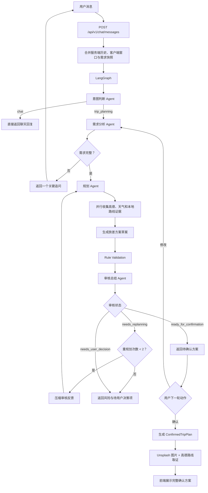
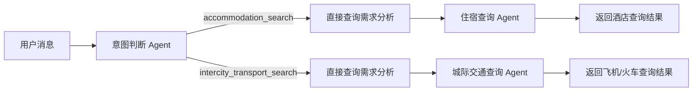

# TripWeave - 旅差智能助手

> 当前文档按代码实际状态维护，最近核对日期：2026-08-16。

## 1. 当前状态

TripWeave 当前是一个以对话为入口的旅差规划 Demo：

- 前端使用 React、TypeScript 和 Vite，提供聊天窗口、失败重试和旅差需求快捷补充面板。
- 后端使用 FastAPI，入口为 `POST /api/v1/chat/messages`。
- 后端使用 LangGraph 编排意图判断、需求分析、规划、工具查询、规则校验、审核和确认流程。
- 大模型客户端使用 OpenAI 兼容协议，当前可配置 DeepSeek、OpenAI 和第三方代理供应商。
- 通过 `conversation_id` 关联 LangGraph `thread_id`，工作流状态由 SQLite Checkpointer 持久化。
- 服务端 SQLite Checkpointer 保存会话历史；浏览器回传的本地上下文窗口只作为兼容输入。
- 高德和风天气能力通过后端 Tools 调用；酒店和城际交通当前使用本地估算 Tools，不代表实时价格、库存或余票。
- 用户确认方案后，后端异步补充 Unsplash 景点/美食图片和高德城市内路线摘要，并通过 `confirmed_plan.details` 返回前端。
- 当前只生成推荐方案，不执行真实购票、订房或支付。

当前默认可以只配置 DeepSeek。未配置的备用供应商会被跳过；所有供应商都不可用时，接口会返回统一业务错误。

## 2. 当前运行流程

### 2.1 主流程



### 2.2 直接查询分支

统一入口还支持两个不进入完整行程规划的查询意图：



直接查询字段不足时，系统只追问查询所需的最小字段。查询失败会返回明确的不可用状态，不会伪装成实时结果。

## 3. Agent 与工作流职责

| 组件 | 当前职责 | 当前状态 |
| --- | --- | --- |
| 意图判断 Agent | 区分普通聊天、旅差规划、酒店查询、城际交通查询，并识别确认或修改动作 | 已实现 |
| 需求分析 Agent | 提取并合并 `TripRequirements`，补充日期和时长归一化，按本地规则计算缺失字段 | 已实现 |
| 规划 Agent | 收集可信工具证据，再由模型生成 Markdown 方案草案；支持审核反馈和用户修改触发的重规划 | 已实现 |
| 住宿查询 Agent | 通过本地酒店估算 Tool 生成价格、房型和库存参考 | 已实现 |
| 城际交通查询 Agent | 通过本地交通估算 Tool 生成飞机和火车班次参考 | 已实现 |
| 审核总结 Agent | 根据方案、规则校验和工具证据生成总结、风险和待确认项；状态仍由本地规则决定 | 已实现 |
| 会话历史策略 | Checkpointer 保存最多 120 条；模型每次读取最近 8 条和其外 6 条历史，不调用摘要 Agent | 已实现 |
| 用户确认 | 由 LangGraph 节点处理，确认后生成带图片和路线详情的 `ConfirmedTripPlan` | 已实现 |

吃、住、行、景点和天气不再拆成独立业务 Agent。规划取证层通过 Tools 调用这些能力，减少多 Agent 转发和自由文本传递。

### 3.1 规划 Agent 的实际调用方式

当前规划 Agent 不是模型原生 `tool_calls` 自主循环，而是由后端代码先完成取证，再把压缩后的证据交给模型生成方案：

1. 校验需求完整性。
2. 调用地图地理编码获取目的地坐标。
3. 并发查询住宿、景点和餐饮 POI。
4. 按候选地点计算少量本地交通路线。
5. 在出发日期落入未来十天窗口时查询天气；超出窗口则明确标记为不可用或跳过。
6. 将需求、工具证据和有限的重规划反馈交给规划模型。
7. 生成非空 Markdown 方案草案。

因此，当前 Tools 是后端规划取证层的可靠数据源，规划模型负责解释和编排，不直接控制外部 API 或浏览器。

## 4. 核心契约

### 4.1 `ConversationAnalysis`

```text
intent:
  chat
  trip_planning
  accommodation_search
  intercity_transport_search
reply: str
requirements: TripRequirements | null
plan_action: plan | modify | confirm | null
pending_plan: TripPlanSnapshot | null
confirmed_plan: ConfirmedTripPlan | null
missing_fields: list[str]
is_complete: bool | null
```

普通聊天不能携带 `requirements`。旅差规划和直接查询意图必须携带结构化需求对象。`missing_fields` 和 `is_complete` 由后端本地规则计算，不能仅信任模型自行判断。

### 4.2 `TripRequirements`

```text
origin: str | null
destination: str | null
departure_date: str | null
return_date: str | null
trip_duration: TripDuration | null
traveler_count: int | null
budget: str | null
transport_preferences: list[str]
accommodation_preferences: list[str]
dining_preferences: list[str]
attraction_preferences: list[str]
general_preferences: list[str]
fixed_schedule: list[str]
```

进入完整旅差规划的最低字段为：

- `destination`
- `departure_date`
- `return_date` 或 `trip_duration`
- `traveler_count`

### 4.3 旅行时长

旅行时长保留用户原始表达，并使用结构化单位：

```json
{
  "raw_text": "一周",
  "amount": 1,
  "unit": "week",
  "is_approximate": false
}
```

`unit` 只能是 `hour`、`day`、`week` 或 `month`。例如：

- “半天”表示 `0.5 + day`
- “三天”表示 `3 + day`
- “一周”表示 `1 + week`
- “一个月”表示 `1 + month`

周和月不会在需求分析阶段强行折算成固定天数；在已有出发日期时，规划层再按日历语义计算。无法可靠识别的相对日期会保留原文，不会编造具体日期。

### 4.4 方案确认状态

`ReviewResult.status` 由本地规则计算：

| 状态 | 含义 |
| --- | --- |
| `ready_for_confirmation` | 没有阻断性硬错误，返回待用户确认方案 |
| `needs_replanning` | 存在可自动修复的问题，最多自动重规划 2 次 |
| `needs_user_decision` | 存在无法由系统安全修复的问题，返回风险和待用户决策项 |

模型只负责生成审核摘要、风险和待确认项，不能自行修改审核状态或绕过硬约束。

确认成功后，`ConversationAnalysis.confirmed_plan` 会额外包含：

- `details.images`：Unsplash 景点和美食图片、缩略图、描述、摄影者和来源链接。
- `details.routes`：从目的地中心到代表性景点/餐饮候选的公交、步行和驾车路线摘要。
- `details.tool_status`：`available`、`unavailable` 或 `skipped`，第三方不可用时不阻断确认。

## 5. 记忆与请求状态

当前没有业务数据库、Redis 或独立长期记忆服务。系统分为两层状态：

- LangGraph 工作流状态和会话历史：由服务端 SQLite Checkpointer 持久化。
- 浏览器兼容窗口：由前端回传最近 8 条消息。

前端保存并回传：

- `short_term_memory`：最近 8 条消息；`summary` 仅为旧客户端兼容字段。
- `conversation_id`：服务端创建的会话 ID，后续请求必须保持不变。

`known_requirements` 和 `pending_plan` 仍被后端接受，用于兼容旧客户端；当前前端不再依赖它们作为恢复待确认方案的唯一来源。

后端每轮会：

1. 根据 `conversation_id` 从 Checkpointer 读取服务端历史。
2. 将服务端历史和本轮客户端消息按重叠后缀合并，避免重复。
3. 服务端最多保留 120 条消息，并将本轮助手回复写回 Checkpointer。
4. 入口 Agent 每次把最近 8 条消息完整传给模型，再附加其外 6 条较早历史；较早助手长回复会截短。
5. 结构化 `TripRequirements`、`pending_plan` 和 `review_result` 作为稳定业务记忆，不依赖自然语言历史猜测。

完整方案不依赖助手长文本记忆保存，而是由 Checkpointer 按 `conversation_id` 保存。服务重启后，使用同一会话 ID 可以恢复待确认方案、审核状态和历史消息。

### 5.1 成本控制策略

- 纯问候、明确人数/日期/时长补充、明确酒店或交通查询等确定性意图优先由本地规则处理，跳过一次意图判断 LLM。
- 需求分析 Agent 仍保留，用于理解预算、偏好、纠错和自然语言字段合并。
- 规划 Agent 仍保留，用于根据 Tools 证据生成完整方案。
- 审核总结 Agent 保留，用于整理方案风险和用户可读结论；审核状态由本地规则校验，模型不能越权改变分支。
- `accommodation_search_agent.py` 和 `intercity_transport_search_agent.py` 当前只是查询适配器，不调用 LLM；后续可在目录清理时改名为 service，但不会产生模型成本。

### 5.2 Checkpointer 生命周期

- 首次请求未携带 `conversation_id` 时，后端生成 UUID。
- 后续请求将该 UUID 作为 LangGraph 的 `thread_id`。
- 默认检查点文件为 `backend/data/tripweave_checkpoints.sqlite`。
- FastAPI 启动时打开 SQLite 连接并初始化表结构，关闭时释放连接。
- 当前审批等待仍以 `await_confirmation` 节点结束本轮请求；下一轮使用同一会话 ID恢复状态。后续如需真正的 `interrupt()` 恢复协议，可在此基础上扩展。

## 6. Tools 与外部集成

### 6.1 本地 Tools

| 文件 | 能力 |
| --- | --- |
| `backend/app/tools/map_route_tool.py` | 高德地理编码、POI、步行/公交/驾车/骑行路线 |
| `backend/app/tools/poi_search.py` | 城市和周边 POI 查询公共封装 |
| `backend/app/tools/accommodation_tool.py` | 住宿 POI 查询，不代表真实价格或库存 |
| `backend/app/tools/attraction_tool.py` | 景点 POI 查询，不代表门票或开放状态 |
| `backend/app/tools/food_tool.py` | 餐饮 POI 查询，不代表评分或营业状态 |
| `backend/app/tools/hotel_search_tool.py` | 本地酒店价格估算，不访问实时 API |
| `backend/app/tools/traffic_search_tool.py` | 本地飞机/高铁价格估算，不代表实时票价或余票 |
| `backend/app/tools/transport_tool.py` | 本地交通方式规划和不可用方式收敛 |
| `backend/app/tools/weather_tool.py` | 和风天气实时天气、逐日/逐小时预报和预警 |

### 6.2 确认方案服务

| 文件 | 能力 |
| --- | --- |
| `backend/app/services/unsplash_service.py` | 后端异步搜索 Unsplash 图片并提取安全展示字段 |
| `backend/app/services/confirmed_trip_service.py` | 确认后并发收集图片和高德路线，统一降级为可展示状态 |

### 6.3 LLM 集成

`backend/app/integrations/llm/` 负责：

- 主供应商和备用供应商路由。
- 当前供应商内重试。
- OpenAI 兼容请求封装。
- JSON 响应清洗和结构化契约校验。
- 原始请求/响应调试日志开关。
- 日志脱敏。

`response_cleaner.py` 会处理 BOM、零宽字符、不换行空格、首尾空白、Markdown JSON 代码围栏和 JSON 前置说明，但不会猜测性修复任意业务字段。

## 7. 启动

### 7.1 后端

在 `backend` 目录创建 `.env`：

```powershell
cd backend
Copy-Item .env.example .env
```

至少配置一个模型：

```dotenv
LLM_PROVIDER=deepseek
DEEPSEEK_API_KEY=你的密钥
DEEPSEEK_BASE_URL=https://api.deepseek.com
DEEPSEEK_MODEL=deepseek-v4-flash
```

创建环境并启动：

```powershell
cd backend
python -m venv .venv
.\.venv\Scripts\Activate.ps1
pip install -r requirements.txt
uvicorn app.main:app --reload --port 8000
```

后端地址默认是 `http://127.0.0.1:8000`，健康检查：

```text
http://127.0.0.1:8000/api/v1/health
```

也支持：

```powershell
python -m app.main
```

### 7.2 前端

```powershell
cd frontend
npm install
npm run dev
```

前端默认地址为 `http://localhost:5173`。如后端地址不同，可设置：

```powershell
$env:VITE_API_BASE_URL="http://127.0.0.1:8000"
npm run dev
```

生产构建：

```powershell
npm run build
```

## 8. 配置

完整模板位于 `backend/.env.example`。常用配置如下：

| 变量 | 默认值 | 作用 |
| --- | --- | --- |
| `LLM_PROVIDER` | `deepseek` | 主模型供应商：`deepseek`、`openai` 或 `proxy` |
| `LLM_FALLBACK_PROVIDERS` | 空或按模板配置 | 备用供应商顺序，仅已配置供应商会调用 |
| `LLM_MAX_RETRIES` | `3` | 单供应商可恢复错误的最大尝试次数 |
| `LLM_DEBUG_LOG_RAW_OUTPUT` | `false` | 契约失败时记录脱敏后的模型原始响应 |
| `LLM_DEBUG_LOG_RAW_REQUEST` | `false` | 契约失败时记录 Agent 请求上下文和生成参数 |
| `DEEPSEEK_API_KEY` | - | DeepSeek API Key |
| `DEEPSEEK_BASE_URL` | `https://api.deepseek.com` | DeepSeek 基础地址 |
| `DEEPSEEK_MODEL` | - | 普通 Agent 使用的 DeepSeek 模型 |
| `DEEPSEEK_REVIEW_MODEL` | `deepseek-v4-pro` | 审核总结 Agent 使用的模型 |
| `OPENAI_API_KEY` / `OPENAI_BASE_URL` / `OPENAI_MODEL` | - | OpenAI 配置 |
| `PROXY_API_KEY` / `PROXY_BASE_URL` / `PROXY_MODEL` | - | OpenAI 兼容中转站配置 |
| `AMAP_WEB_SERVICE_KEY` | - | 高德 Web 服务 Key |
| `AMAP_WEB_SERVICE_BASE_URL` | `https://restapi.amap.com` | 高德服务地址 |
| `QWEATHER_API_HOST` | - | 和风天气控制台分配的专属 Host |
| `QWEATHER_API_KEY` | - | 和风天气服务端 Key |
| `UNSPLASH_ACCESS_KEY` | - | Unsplash 图片搜索 Access Key |
| `UNSPLASH_BASE_URL` | `https://api.unsplash.com` | Unsplash API 地址 |
| `LANGGRAPH_CHECKPOINT_PATH` | `data/tripweave_checkpoints.sqlite` | LangGraph SQLite 检查点文件，相对 `backend` 目录 |
| `CORS_ALLOW_ORIGINS` | `http://localhost:5173,http://127.0.0.1:5173` | 允许访问后端的前端地址 |
| `LOG_MAX_BYTES` | `1048576` | 单个日志文件最大字节数 |
| `LOG_BACKUP_COUNT` | `5` | 日志滚动保留数量 |

日志默认写入 `backend/app/logs/`，文件名包含启动时间。正常日志只记录请求 ID、调用阶段、耗时、结果形态、数量和错误摘要，不记录密钥。

调试模型契约时可以临时开启：

```dotenv
LLM_DEBUG_LOG_RAW_OUTPUT=true
LLM_DEBUG_LOG_RAW_REQUEST=true
```

这两个开关可能记录对话内容，只能在本地或受控环境使用，排障完成后应关闭并重启后端。

## 9. API

### 9.1 已实现接口

| 方法 | 路径 | 说明 |
| --- | --- | --- |
| `POST` | `/api/v1/chat/messages` | 提交本轮消息并返回 `analysis` 与 `short_term_memory` |
| `GET` | `/api/v1/health` | 服务健康检查 |

### 9.2 请求示例

```json
{
  "conversation_id": null,
  "messages": [
    {
      "role": "user",
      "content": "下个月从广州去北京玩一周，一共五个人"
    }
  ],
  "short_term_memory": null,
  "known_requirements": null,
  "pending_plan": null
}
```

前端实际使用时通常只提交当前用户消息，并回传上一轮返回的 `conversation_id` 和 `short_term_memory`。旧客户端仍可额外提交 `known_requirements` 和 `pending_plan`。

### 9.3 响应示例

```json
{
  "conversation_id": "00000000-0000-4000-8000-000000000001",
  "analysis": {
    "intent": "trip_planning",
    "reply": "请问您计划哪天出发？",
    "requirements": {
      "origin": "广州",
      "destination": "北京",
      "departure_date": null,
      "return_date": null,
      "trip_duration": {
        "raw_text": "一周",
        "amount": 1,
        "unit": "week",
        "is_approximate": false
      },
      "traveler_count": 5,
      "budget": null,
      "transport_preferences": [],
      "accommodation_preferences": [],
      "dining_preferences": [],
      "attraction_preferences": [],
      "general_preferences": [],
      "fixed_schedule": []
    },
    "plan_action": "plan",
    "pending_plan": null,
    "confirmed_plan": null,
    "missing_fields": ["departure_date"],
    "is_complete": false
  },
  "short_term_memory": {
    "summary": null,
    "recent_messages": [
      {
        "role": "user",
        "content": "下个月从广州去北京玩一周，一共五个人"
      },
      {
        "role": "assistant",
        "content": "请问您计划哪天出发？"
      }
    ]
  }
}
```

实际字段以 `backend/app/schemas.py` 为准。业务异常统一由后端错误处理器返回，模型供应商全部不可用时错误码为 `LLM_FALLBACK_EXHAUSTED`。

## 10. 项目结构

```text
TripWeave/
├── README.md
├── AGENT.md
├── .env.example
├── backend/
│   ├── .env.example
│   ├── requirements.txt
│   ├── app/
│   │   ├── main.py
│   │   ├── schemas.py
│   │   ├── api/
│   │   │   ├── exception/
│   │   │   └── router/
│   │   │       ├── chat.py
│   │   │       └── health.py
│   │   ├── agents/
│   │   │   ├── conversation_entry_agent.py
│   │   │   ├── planning_agent.py
│   │   │   ├── planning_evidence.py
│   │   │   ├── review_agent.py
│   │   │   ├── accommodation_search_agent.py
│   │   │   ├── intercity_transport_search_agent.py
│   │   │   ├── prompts/
│   │   │   └── skills/
│   │   │       └── trip-planning/
│   │   ├── core/
│   │   │   ├── settings.py
│   │   │   ├── logging.py
│   │   │   └── trip_duration.py
│   │   ├── memory/
│   │   │   └── short_term_memory.py
│   │   ├── tools/
│   │   │   ├── map_route_tool.py
│   │   │   ├── poi_search.py
│   │   │   ├── accommodation_tool.py
│   │   │   ├── attraction_tool.py
│   │   │   ├── food_tool.py
│   │   │   ├── hotel_search_tool.py
│   │   │   ├── traffic_search_tool.py
│   │   │   ├── transport_tool.py
│   │   │   └── weather_tool.py
│   │   ├── services/
│   │   │   ├── unsplash_service.py
│   │   │   └── confirmed_trip_service.py
│   │   ├── integrations/
│   │   │   └── llm/
│   │   ├── workflows/
│   │   │   └── trip_conversation_graph.py
│   │   └── logs/
│   └── tests/
└── frontend/
    ├── package.json
    └── src/
        ├── App.tsx
        ├── main.tsx
        └── styles.css
```

`__pycache__`、测试缓存、前端 `node_modules` 和运行日志属于本地生成物，不是业务源代码。

## 11. 测试与验证

后端测试使用 Python 标准库 `unittest`，从 `backend` 目录运行：

```powershell
cd backend
python -m unittest discover -s tests -p "test_*.py" -v
```

也可以进行 Python 编译检查：

```powershell
python -m compileall -q app tests
```

前端构建检查：

```powershell
cd frontend
npm run build
```

测试目录用于覆盖入口 Agent、LangGraph 直接查询分支、短期记忆、规划 Agent、审核 Agent、日志与异常处理以及各类工具。当前工作区测试源码未完整保留，恢复测试文件后再执行上述完整测试命令。

## 12. 当前边界与后续计划

### 当前未实现

- 业务数据库、Redis、长期记忆和带身份认证的跨设备会话。
- `/api/v1/trips` 计划 CRUD、重规划和确认接口。
- 真实订单创建、支付、购票和订房。
- 稳定的实时票价、库存和第三方预订 API。
- Docker Compose、端到端浏览器测试和生产部署配置。
- 模型原生自主 Tool Calls 循环。

### 后续建议

1. 先补充真实外部数据源的契约测试和观测指标。
2. 再把当前浏览器快照和前端状态迁移到服务端会话存储。
3. 增加独立的行程方案接口，降低聊天接口承载的状态复杂度。
4. 在需求和工具契约稳定后，再评估是否需要把规划取证改造成模型原生 Tool Calls。
5. 最后接入长期记忆、企业差旅规则、订单和审批系统。

## 13. 安全与数据要求

- API Key 和第三方密钥只能通过环境变量提供，禁止提交真实密钥。
- 模型原始请求和响应调试日志默认关闭，开启后只在受控环境短时使用。
- 工具调用必须设置超时、结果长度限制和失败降级。
- 外部查询结果必须标注估算或快照性质，不能把候选 POI、价格、库存和余票伪装成已确认订单。
- 模型输出必须先经过 JSON 清洗、Pydantic 契约校验和本地规则校验，再进入工作流或前端展示。
