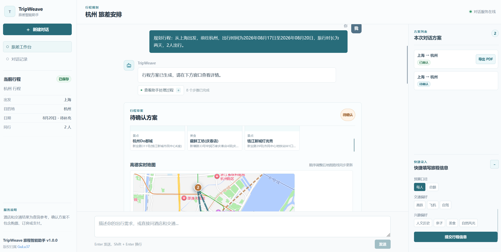
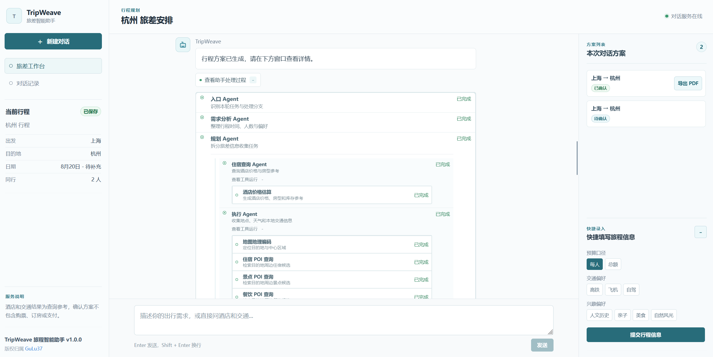
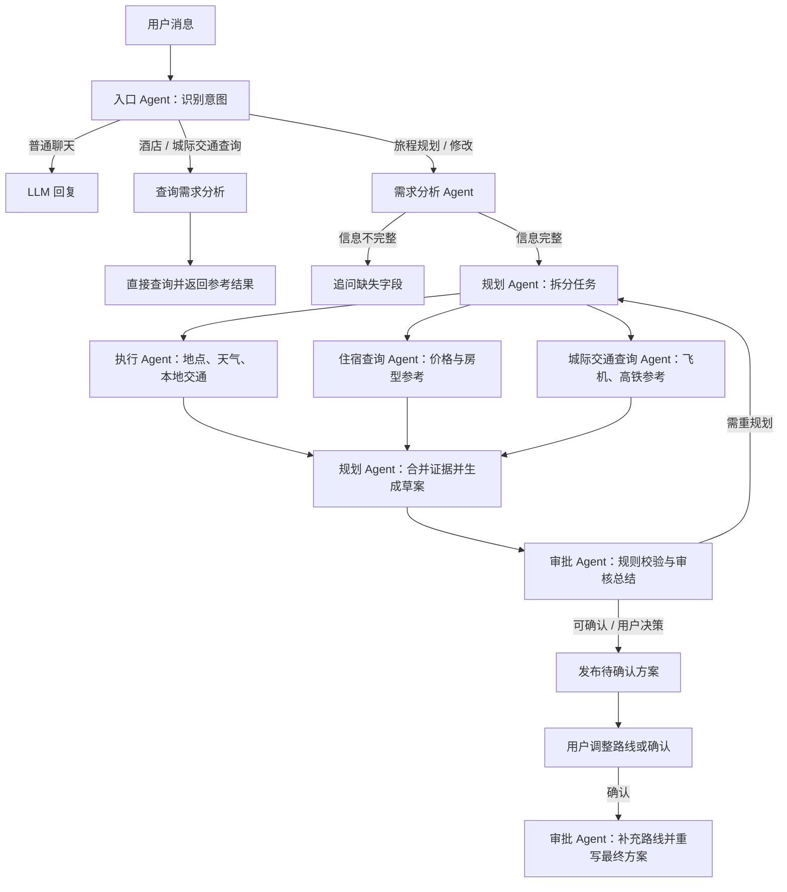

# TripWeave

> 面向个人与商务出行的对话式旅程规划助手。通过自然语言收集需求、并行获取目的地信息，并在用户确认路线后生成可执行的最终行程。

<p align="center">
  
  
</p>

## 项目简介

TripWeave 将“聊天理解需求”和“可确认的路线方案”放在同一个工作台中：

- 用户可直接描述出发地、目的地、日期、人数、预算和偏好，也可用右侧表单快速补齐。
- 系统先识别本轮意图：普通聊天、完整旅程规划、酒店查询或城际交通查询。
- 完整需求会进入 LangGraph 工作流，由规划 Agent 分派三个并行子 Agent 收集目的地、住宿与城际交通信息。
- 规划草案需经过确定性规则校验和审批 Agent 审核；不通过时会复用原进度项回流重规划。
- 待确认方案支持拖动景点、美食卡片调整路线顺序，并同步更新地图和城市内路线。
- 用户确认后，系统按确认路线重写最终行程，展示出发地至目的地概览、城市内导航摘要和天气信息。

TripWeave 只提供行程决策参考，不创建订单，也不执行购票、订房或支付。酒店与城际交通当前为估算参考，不代表实时价格、库存、余票或可预订状态。

## 功能一览

| 能力 | 说明 |
| --- | --- |
| 对话式需求收集 | 识别出发地、目的地、出发日期、返程/时长、人数、预算与出行偏好；缺少关键字段时只追问最小必要信息。 |
| 普通闲聊 | 无旅行意图时由 LLM 自然回复，不强制进入行程规划。 |
| 直接查询 | 酒店与飞机/火车查询走轻量分支，不触发完整旅程规划。 |
| 并行旅程取证 | 规划 Agent 并行调度执行 Agent、住宿查询 Agent、城际交通查询 Agent。 |
| 可视化处理进度 | 前端按后端真实执行事件展示 Agent、工具、父子关系、完成、失败和不可用状态。 |
| 方案审核与回流 | 本地规则决定审核状态；可自动修复的问题会回流规划 Agent，无法安全修复的问题交由用户决策。 |
| 路线规划 | 待确认方案可拖动景点/美食卡片；高德地图路线与城市内交通顺序随之更新。 |
| 确认后重写 | 确认路线后生成面向用户的最终文本计划，去除工具调用和模型格式噪声。 |
| 方案归档 | 当前对话的待确认、已确认方案会显示在右侧列表；已确认方案可调用浏览器打印并保存为 PDF。 |
| 会话恢复 | LangGraph SQLite Checkpointer 按 `conversation_id` 保存服务端上下文与工作流状态。 |

## 工作流



### Agent 职责

| Agent / 节点 | 职责 |
| --- | --- |
| 入口 Agent | 判断聊天、旅程规划、酒店查询、城际交通查询及确认/修改动作。 |
| 需求分析 Agent | 合并上下文与结构化需求，规范化日期、时长和人数，并计算真实缺失字段。 |
| 规划 Agent | 分派并合并并行取证结果，生成或重生成旅程草案。 |
| 执行 Agent | 查询目的地 POI、天气和本地交通证据。 |
| 住宿查询 Agent | 生成酒店价格、房型和库存估算参考。 |
| 城际交通查询 Agent | 生成飞机和高铁班次、价格估算参考。 |
| 审批 Agent | 执行规则校验、生成审核结论，并在确认后补充路线信息和最终文本。 |

## 技术栈

- 前端：React 19、TypeScript、Vite
- 后端：FastAPI、Pydantic、Uvicorn
- 工作流：LangGraph、SQLite Checkpointer、aiosqlite
- LLM：OpenAI 兼容接口；默认支持 DeepSeek，并可配置 OpenAI 或兼容代理作为备用供应商
- 地图：高德 Web 服务 API、前端高德 Web JS API
- 天气：和风天气 API

## 目录结构

```text
TripWeave/
├── docs/
│   └── images/                         # GitHub README 演示截图
├── backend/
│   ├── .env.example                    # 后端环境变量模板
│   ├── requirements.txt
│   ├── app/
│   │   ├── api/                        # 聊天、进度和健康检查接口
│   │   ├── agents/                     # 入口、规划、执行、查询、审批 Agent
│   │   ├── core/                       # 配置、日志、旅行时长工具
│   │   ├── integrations/llm/           # OpenAI 兼容模型客户端与响应清洗
│   │   ├── services/                   # 处理进度、确认方案路线服务
│   │   ├── tools/                      # 高德、天气、POI、酒店和交通工具
│   │   ├── workflows/                  # LangGraph 编排
│   │   ├── main.py                     # FastAPI 应用入口
│   │   └── schemas.py                  # API 与工作流数据契约
│   └── tests/
├── frontend/
│   ├── .env.example                    # 前端地图配置模板
│   ├── src/
│   │   ├── App.tsx                     # 对话工作台和地图交互
│   │   └── styles.css
│   └── package.json
└── README.md
```

## 快速开始

### 1. 准备后端

进入后端目录，复制环境变量模板：

```powershell
cd backend
Copy-Item .env.example .env
```

至少配置一个 LLM 供应商。以 DeepSeek 为例：

```dotenv
LLM_PROVIDER=deepseek
DEEPSEEK_API_KEY=your_api_key
DEEPSEEK_BASE_URL=https://api.deepseek.com
DEEPSEEK_MODEL=deepseek-v4-flash
DEEPSEEK_REVIEW_MODEL=deepseek-v4-pro
```

创建 Python 环境并启动服务：

```powershell
python -m venv .venv
.\.venv\Scripts\Activate.ps1
pip install -r requirements.txt
uvicorn app.main:app --reload --port 8000
```

后端默认运行在 `http://127.0.0.1:8000`，可用以下地址检查服务：

```text
http://127.0.0.1:8000/api/v1/health
```

### 2. 准备前端

另开一个终端：

```powershell
cd frontend
npm install
Copy-Item .env.example .env.local
npm run dev
```

前端默认运行在 `http://127.0.0.1:5173`。

若后端不在默认地址，可在 `frontend/.env.local` 中配置：

```dotenv
VITE_API_BASE_URL=http://127.0.0.1:8000
```

生产构建：

```powershell
npm run build
```

## 配置说明

### LLM

后端从 `backend/.env` 读取模型设置：

| 变量 | 说明 |
| --- | --- |
| `LLM_PROVIDER` | 主供应商：`deepseek`、`openai` 或 `proxy`。 |
| `LLM_FALLBACK_PROVIDERS` | 备用供应商列表，逗号分隔；只会调用已完整配置的供应商。 |
| `LLM_MAX_RETRIES` | 单一供应商发生可恢复错误时的最大尝试次数。 |
| `DEEPSEEK_API_KEY` / `DEEPSEEK_BASE_URL` / `DEEPSEEK_MODEL` | 常规 Agent 使用的 DeepSeek 配置。 |
| `DEEPSEEK_REVIEW_MODEL` | 审批 Agent 使用的 DeepSeek Pro 模型。 |
| `OPENAI_*` | OpenAI 兼容配置。 |
| `PROXY_*` | 第三方 OpenAI 兼容代理配置。 |

### 地图与天气

| 变量 | 位置 | 说明 |
| --- | --- | --- |
| `AMAP_WEB_SERVICE_KEY` | `backend/.env` | 后端地理编码、POI 与路径规划。 |
| `AMAP_WEB_SERVICE_BASE_URL` | `backend/.env` | 高德 Web 服务地址，通常无需修改。 |
| `VITE_AMAP_WEB_JS_KEY` | `frontend/.env.local` | 浏览器渲染最终方案实时地图。 |
| `VITE_AMAP_SECURITY_CODE` | `frontend/.env.local` | 高德 Web JS API 配置安全密钥时使用。 |
| `QWEATHER_API_HOST` | `backend/.env` | 和风天气控制台分配的专属 API Host。 |
| `QWEATHER_API_KEY` | `backend/.env` | 和风天气服务端密钥。 |

地图或天气未配置时，相关能力会降级为不可用或跳过，不应阻断对话、草案或方案确认。

### 运行与数据

| 变量 | 说明 |
| --- | --- |
| `LANGGRAPH_CHECKPOINT_PATH` | LangGraph SQLite 检查点文件，默认 `backend/data/tripweave_checkpoints.sqlite`。 |
| `CORS_ALLOW_ORIGINS` | 允许访问 API 的前端地址，多个地址以英文逗号分隔。 |
| `LOG_MAX_BYTES` / `LOG_BACKUP_COUNT` | 后端日志滚动策略。 |
| `LLM_DEBUG_LOG_RAW_OUTPUT` / `LLM_DEBUG_LOG_RAW_REQUEST` | 调试模型契约时输出脱敏后的原始内容；仅限本地、受控环境短时开启。 |

## API

### `POST /api/v1/chat/messages`

提交本轮消息，返回统一意图分析、结构化需求、待确认/已确认方案、执行进度和兼容上下文窗口。

请求示例：

```json
{
  "conversation_id": null,
  "client_request_id": null,
  "messages": [
    {
      "role": "user",
      "content": "下周从上海去杭州出差两天，2 人同行"
    }
  ],
  "short_term_memory": null,
  "known_requirements": null,
  "pending_plan": null
}
```

关键返回字段：

| 字段 | 说明 |
| --- | --- |
| `conversation_id` | 后续请求需回传的会话 ID，也是 LangGraph `thread_id`。 |
| `analysis.intent` | `chat`、`trip_planning`、`accommodation_search` 或 `intercity_transport_search`。 |
| `analysis.reply` | 可直接展示给用户的回复。 |
| `analysis.requirements` | 解析后的旅程或查询需求。 |
| `analysis.pending_plan` | 待确认的规划草案、审核结果、地图点位和路线信息。 |
| `analysis.confirmed_plan` | 用户确认后生成的最终方案。 |
| `analysis.search_results` | 酒店或城际交通的结构化参考结果。 |
| `progress_events` | 本轮实际 Agent 与工具执行进度。 |

### `GET /api/v1/chat/progress/{client_request_id}`

前端轮询本轮真实执行状态。事件会携带 Agent 名称、动作、工具名称、父事件、状态和失败原因，不包含模型思考正文。

### `GET /api/v1/health`

返回 API 服务状态与版本。

## 状态与数据边界

- `conversation_id` 用于恢复服务端的工作流状态；更换 ID 即视为新会话。
- SQLite Checkpointer 保存会话消息、需求快照、待确认方案和工作流检查点。开发时不要在服务运行中手动删除 `.sqlite-wal` 或 `.sqlite-shm` 文件。
- 浏览器仅保留有限的兼容上下文窗口，完整状态以服务端 Checkpointer 为准。
- 一次助手回复最多携带一个新生成的待确认方案；历史方案在当前对话中保留，并显示在右侧方案列表。
- 方案确认只生成最终行程文本和路线参考，不会产生任何第三方订单。

## 验证

后端测试位于 `backend/tests/`。安装测试工具后可执行：

```powershell
cd backend
python -m pytest tests -q
```

前端类型检查和生产构建：

```powershell
cd frontend
npm run build
```

## 当前限制

- 酒店、飞机和火车结果目前为本地估算参考，未接入实时价格、库存、余票或预订 API。
- 高德和和风天气依赖相应的 API Key、网络和第三方服务可用性。
- 会话状态保存在本地 SQLite，适合本地开发和 Demo；生产环境应增加身份认证、备份、清理策略及更合适的持久化方案。
- 当前不包含支付、购票、订房、企业审批、订单管理或跨设备账户体系。

## 安全建议

- 不要提交 `backend/.env`、`frontend/.env.local` 或任何真实 API Key。
- 原始 LLM 请求/响应调试日志可能包含对话内容，排障结束后应立即关闭调试开关。
- 对外部署时请收紧 `CORS_ALLOW_ORIGINS`，并为 API 增加鉴权、限流与审计。

## 版权

TripWeave 旅程智能助手 v1.0.0<br>
版权归属 [GuLu37](https://github.com/GuLu37)
